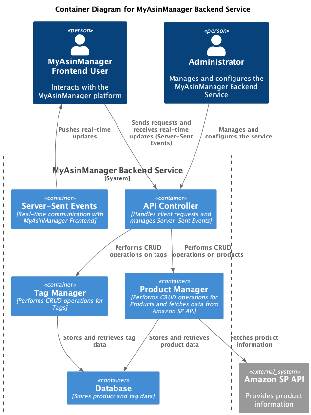

# MyAsinManager: An Amazon Product Management System
MyAsinManager is an Amazon product management system designed to help Amazon sellers effectively track and analyze their products. By automating real-time price tracking and providing advanced filtering options based on various criteria, this system streamlines the product management process and increases seller productivity.

The service fetches product information from the Amazon SP API and stores it in a database for efficient tracking and analysis. In addition, MyAsinManager allows sellers to manage tags and their relations to products through intuitive CRUD operations. The system also leverages Server-Sent Events to keep the platform up-to-date in real-time.

With the MyAsinManager Backend Service, sellers can make informed decisions based on accurate and timely product data, optimizing their product catalog and ultimately

## MyAsinManager Backend Service
This service is responsible for providing the necessary functionality for the MyAsinManager platform, including fetching products from the Amazon SP API, storing and updating product information, and handling CRUD operations for tags and their relations to products. Additionally, the service serves the frontend using Server-Sent Events to keep the platform updated in real-time.

Running the Application
The spring-boot application can be run using the following command:

`mvn spring-boot:run`

## Functionality

- Fetching products from the Amazon SP API and storing them in the database:The service retrieves information about products from the Amazon SP API and stores them in the database for later use.
- Asynchronous API calls: The service makes asynchronous calls to the API in order to keep the product information up-to-date.
- CRUD operations for Tags: The service provides functionality for creating, reading, updating, and deleting tags, as well as managing their many-to-many relationship with products.
- Server-Sent Events: The service serves the frontend using Server-Sent Events, allowing the platform to stay updated in real-time.

## Dependencies
Spring Boot
Maven

